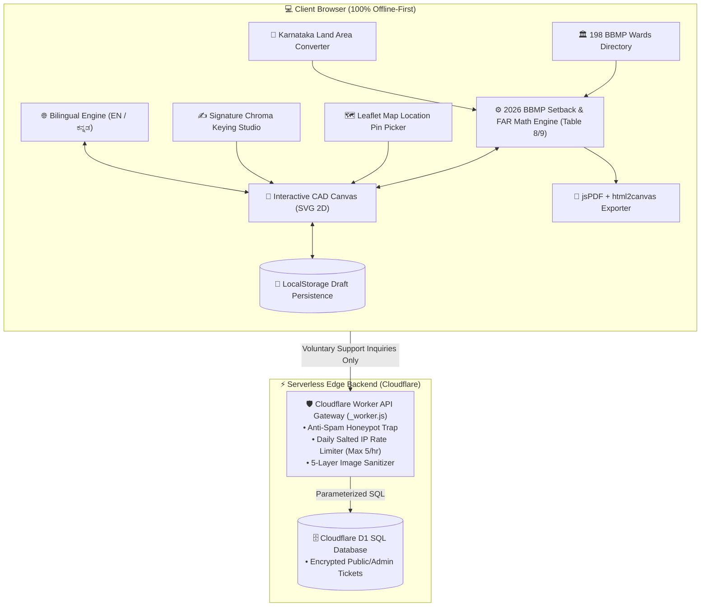

<div align="center">

# 🏛️ e-Plan Studio
### Automated Single Plot Layout Plan Drafting Engine

[](https://opensource.org/licenses/MIT)
[](#-exhaustive-automated-testing-suite)
[](#-bilingual-localization-english--%E0%B2%95%E0%B2%A8%E0%B3%8D%E0%B2%A8%E0%B2%A1)
[](#-data-privacy--architectural-integrity)
[](https://single-site-plan.cranbear.workers.dev)
[](#-essential-domain-glossary)
[](https://buymeacoffee.com/cranbear)

<p>
  <strong>Instant, 100% client-side vector CAD site plan generator for single plot layout drawings.</strong><br>
  <em>Designed for B-to-A Khata conversions, Sakala portal submissions, ADLR 11E survey sketches, and municipal layout plan sanctions in Bengaluru, Karnataka.</em>
</p>

<p>
  <a href="https://single-site-plan.cranbear.workers.dev">🌐 <strong>Live Web App</strong></a> &nbsp;•&nbsp;
  <a href="https://github.com/manswis/singleSitePlan-web">📦 <strong>GitHub Repository</strong></a> &nbsp;•&nbsp;
  <a href="https://buymeacoffee.com/cranbear">☕ <strong>Buy Me a Coffee</strong></a>
</p>

<!-- Independent Open-Source Support Card -->
<table>
  <tr>
    <td align="center">
      <br>
      <strong>☕ Support Independent Open-Source Development</strong>
      <br><br>
      <sub><strong>e-Plan Studio is 100% free, private & client-side without paywalls or subscriptions.</strong><br>
      If this tool saved you ₹2,500+ in draftsman or agent fees, consider supporting the creator with a coffee:</sub>
      <br><br>
      <a href="https://buymeacoffee.com/cranbear" target="_blank">
        
      </a>
      <br><br>
    </td>
  </tr>
</table>

</div>

---

## 📌 Overview

In Bengaluru, Karnataka, property owners converting a **B-Khata property into an A-Khata certificate** (via BBMP Sakala / e-Aasthi portals) are required to submit an official **Single Plot Layout Plan**.

**e-Plan Studio** is an open-source, zero-dependency, Apple HIG-inspired web CAD application that enables property owners, licensed architects, and surveyors to generate, preview, and export 100% legally compliant, publication-ready **2-Page Architectural Drawing Packages** in under 60 seconds.

---

## ✨ Key Features

- ⚡ **Real-Time Live 2D CAD Canvas:** Watch your site plan drawing update on screen as you type, complete with vector dimensions, road overlays, hatch patterns, and compass rose.
- 📐 **Automated 2026 BBMP & Karnataka Setback Engine (Table 8 & Table 9):** Calculates statutory front, rear, and side open space clearances based on the 2026 Karnataka Gazette Notification (UDD 235 MNJ 2025(E)). Supports micro plots ($\le 60\text{ m}^2$), 30×40 plots ($60-150\text{ m}^2$), 40×60 plots ($150-250\text{ m}^2$), single-side zero setback tolerances, 12.0m height cap, and stilt parking exclusion.
- 📊 **Live Floor Area Ratio (FAR) & Premium FAR Indicator:** Dynamically computes achieved FAR against road width thresholds ($<30\text{ft}$, $30-40\text{ft}$, and $\ge 40\text{ft}$) with real-time base, TDR loading, and 40% Premium FAR eligibility validation.
- 🗺️ **Interactive Leaflet Map Pin Picker:** Pick precise GPS coordinates on interactive satellite & street maps with automated BBMP Zone centering chips and 4-stage geolocation fallback.
- 🏛️ **198 BBMP Wards & Zones Auto-Suggest Directory:** Integrated searchable directory covering all 198 BBMP Wards across 8 administrative zones with landmark and locality autocomplete.
- 📏 **Karnataka Statutory Land Area Converter:** Convert instantly between 9 statutory land units (Guntas, Gajam/Sq. Yards, Acres, Cents, Ankana, Bigha, Hectares, Sq. Meters, Sq. Feet) and 8 Bangalore plot presets (30×40, 30×50, 40×60, etc.).
- ✍️ **Signature Chroma Keying & Crop Studio:** Real-time signature and architect seal alignment canvas with background thresholding, zoom/pan controls, and direct drawing integration.
- 🌐 **100% Bilingual Localization (English & ಕನ್ನಡ):** Complete native Kannada language support across all form steps, help tooltips, drawing headers, and legal disclaimers.
- 💾 **Draft Session Persistence & `.eplan` Backup:** Automatic local draft autosave with session restore recovery and portable encrypted `.eplan` JSON file import/export.
- ⌨️ **Smart Feet & Inches Auto-Tabbing:** Architectural input controls with auto-advance on 2 digits or delimiter keys (`.`, `Space`, `Enter`, `,`) and safe backspace transitions.
- 🔷 **Regular & Irregular Plot Geometries:** Supports rectangular, trapezoidal, and complex surveyor polygons with custom diagonal measurements and splay boundaries.
- 🔒 **100% Local Client-Side Privacy:** Zero server uploads for CAD math. All property survey numbers, eKhata IDs (ePID), addresses, and CAD geometry remain exclusively inside local browser memory (`localStorage`).
- 📄 **Official 2-Page Sakala PDF Package:** Exports a consolidated 2-page vector PDF:
  - **Page 1:** 70:30 Split-Frame Architectural Site Plan Drawing + Title Block + ADLR Header + General Notes.
  - **Page 2:** Official Colour & Line Specifications Legend Sheet with licensed architect signature & seal blocks.
- 💬 **Live Support Desk & Timeline Tracker:** Integrated issue resolution and feature request hub with real-time status tracking, Apple-style consent dialog, and verified developer conversation threads.
- 📱 **Responsive Apple HIG Workbench:** Seamlessly adapts across mobile, tablet, and desktop viewports with dark/light mode switching.

---

## 🌐 Bilingual Localization (English & ಕನ್ನಡ)

e-Plan Studio features a custom, lightweight, zero-dependency localization engine (`js/i18n/`) offering **100% bilingual parity** across English and Kannada (ಕನ್ನಡ):

* **710+ Curated Translation Keys:** All 7 wizard steps, form labels, error messages, modal dialogs, and button prompts are translated with statutory revenue terminology.
* **Instant Dynamic Switching:** Toggle language seamlessly from the navigation header without reloading the page or losing current form progress.
* **Statutory Kannada Formats:** Automatically localizes drawing sheet title blocks, ward names, and units (e.g. *ಚದರ ಅಡಿ*, *ಗುಂಟೆ*, *ಸರ್ವೇ ನಂಬರ್*, *ಖಾತಾ*).

```javascript
// Switch locale dynamically
window.i18n.setLocale('kn'); // Switch to Kannada
window.i18n.setLocale('en'); // Switch to English
```

---

## 🧪 Exhaustive Automated Testing Suite

The repository contains an enterprise test suite with **37 comprehensive test files** executing in under **2.1 seconds** via a headless Node.js VM and JSDOM simulation environment:

```bash
# Run the complete test suite
npm test
```

### Test Coverage Highlights:
1. **Button & Control Event Handlers:** Verifies all 45 `oninput` handlers and 19 `onchange` dropdowns across the form.
2. **Modal Lifecycles:** Tests open/close state transitions across all 8 modal overlays (Map Picker, BBMP Wards, Land Converter, Signature Crop, Help Desk, Draft Restore, Import Error, Voluntary Support).
3. **BBMP Ward Directory Integrity:** Tests schema validation, search keywords, and zone filtering across all 198 BBMP Wards.
4. **Karnataka Land Unit Conversions:** Mathematically verifies all 14 statutory conversion factors and 8 Bangalore plot presets.
5. **2026 Table 8 & 9 Setbacks & FAR Engine:** Exhaustively validates Table 8 minimums, single-side zero setback tolerances, 12.0m height cap, stilt exclusion, and expected permissible FAR limits for $<30\text{ft}$, $30-40\text{ft}$, and $\ge 40\text{ft}$ road widths.
6. **CAD Math & Auto-Scaling:** Stress-tests extreme aspect ratios (e.g. 10:1 long sites) and irregular 4-side polygon calculations.
7. **Draft Round-Trip Serialization:** Verifies full-form localStorage draft save, restore, corrupted payload recovery, and `.eplan` JSON export/import.
8. **Statutory Legal Gates:** Confirms that PDF export and plan printing are strictly blocked until the user checks the Zero Liability consent gate.

---

## 🏛️ System Architecture



---

## 🏗️ Repository Structure

```
single-site-plan-web/
├── css/
│   ├── styles.css
│   └── styles.min.css
├── js/
│   ├── data/
│   │   └── bbmpWards.js
│   ├── i18n/
│   │   ├── en.js
│   │   └── kn.js
│   ├── admin.js
│   ├── analytics.js
│   ├── contact.js
│   ├── qrcode.js
│   ├── renderer.js
│   ├── theme.js
│   ├── ui.js
│   ├── validator.js
│   └── wizard.js
├── tests/
│   ├── index.js
│   ├── autotab.test.js
│   ├── converter.test.js
│   ├── dom_simulation.test.js
│   ├── ward.test.js
│   ├── integration/
│   └── unit/
├── _worker.js
├── build.js
├── index.html
├── studio.html
├── contact.html
├── admin.html
├── pricing.html
├── legal.html
├── faq.html
├── package.json
├── schema.sql
└── wrangler.toml
```

### 📂 Directory & Module Reference

| Path | Purpose & Responsibilities |
| :--- | :--- |
| **`studio.html`** | Interactive 2D CAD Workbench with live vector drawing canvas and 7-step wizard. |
| **`index.html`** | Google-style product landing page with interactive workflow previews. |
| **`legal.html`** | Terms of Service, Privacy Policy & Section 15 Voluntary Community Support Policy. |
| **`contact.html`** | Public support desk with live multi-message timeline issue tracker. |
| **`admin.html`** | Passkey-protected admin console for support triage and timeline responses. |
| **`js/renderer.js`** | 2D CAD SVG rendering engine, dimension math, setbacks, and north arrow compass. |
| **`js/wizard.js`** | 7-step form state management, draft autosave, and `.eplan` JSON backup/restore. |
| **`js/ui.js`** | DOM event controllers, Leaflet Map Pin Picker, Land Area Converter & jsPDF export. |
| **`js/validator.js`** | BBMP Sakala schema validation, boundary rules, and error scrolling engine. |
| **`js/data/bbmpWards.js`** | Official directory of 198 BBMP Wards across 8 Administrative Zones. |
| **`js/i18n/`** | 100% bilingual English (`en.js`) and Kannada (`kn.js`) translation dictionaries. |
| **`tests/`** | Enterprise test suite containing all 37 unit, DOM, and integration test suites. |
| **`_worker.js`** | Cloudflare Workers serverless API router with rate-limiting and D1 database bindings. |
| **`build.js`** | Ultra-fast `esbuild` production bundler and asset minification script (<30ms). |

---

## 🛠️ Technology Stack

- **Frontend Core:** Semantic HTML5, Vanilla JavaScript (ES6+ Modules), Vanilla CSS3 (Apple Design System).
- **Build Engine:** `esbuild` for ultra-fast, zero-runtime production minification and code compression.
- **Vector CAD Engine:** Scalable Vector Graphics (SVG) with mathematical coordinate transformations.
- **Mapping & Geocoding:** Leaflet.js with OpenStreetMap satellite tiles & 4-stage geolocation fallback.
- **Document Generation:** `jsPDF` + `html2canvas` for client-side vector PDF compilation.
- **Serverless API & Edge Hosting:** Cloudflare Workers with Static Assets.
- **Database:** Cloudflare D1 (Distributed Serverless SQLite).
- **Typography & Icons:** Google Fonts (Outfit, Inter) and Google Material Symbols.

---

## 💻 Local Development Setup

The project provides human-readable source code for development and an automated `esbuild` pipeline for generating compressed, high-performance production assets.

### 1. Clone & Install Dependencies
```bash
git clone https://github.com/manswis/singleSitePlan-web.git
cd singleSitePlan-web
npm install
```

### 2. Run Automated Tests
```bash
npm test
```
*Executes all 37 enterprise unit, statutory, and integration test suites.*

### 3. Build Production Assets (< 30ms)
```bash
npm run build
```
*Minifies all JavaScript modules and CSS stylesheets into production `.min` files.*

---

### Option A: Static Frontend Only (No Backend)

Serve locally via any static web server:
```bash
# Using Python 3
python3 -m http.server 8000

# Or using npx serve
npx serve ./
```
Open `http://localhost:8000` in your web browser.

---

### Option B: Full-Stack with Cloudflare D1 & Worker API

To test the support desk API and database integration locally using Wrangler:

1. **Authenticate with Cloudflare (one-time):**
   ```bash
   npx wrangler login
   ```

2. **Initialize the local D1 SQLite database:**
   ```bash
   npx wrangler d1 execute single_site_plan_support_tickets_db --local --file=schema.sql
   ```

3. **Start the local edge development server:**
   ```bash
   npm run dev
   ```
   Open `http://localhost:8787` in your browser. Both static CAD drafting and `/api/tickets` will run locally with instant hot-reloading.

---

### 🚀 Production Deployment
To build minified assets and deploy directly to Cloudflare Workers:
```bash
npm run deploy
```

---

## 🗄️ Cloudflare D1 Database Integration & Deployment Guide

If you fork this repository to deploy your own instance, follow these steps to connect your Cloudflare D1 database:

### 1. Create a D1 Database
Run the following command to create a serverless D1 instance in your Cloudflare account:
```bash
npx wrangler d1 create single_site_plan_support_tickets_db
```

### 2. Update `wrangler.toml`
Paste your database details into `wrangler.toml`:
```toml
name = "single-site-plan"
main = "_worker.js"
compatibility_date = "2024-09-23"

[assets]
directory = "."
binding = "ASSETS"

[[d1_databases]]
binding = "DB"
database_name = "single_site_plan_support_tickets_db"
database_id = "your-database-uuid-here"
```

### 3. Run Remote Database Migrations
Execute `schema.sql` against your remote Cloudflare database:
```bash
npx wrangler d1 execute single_site_plan_support_tickets_db --remote --file=schema.sql
```

### 4. Configure Your Admin Passkey (`ADMIN_SECRET`)
```bash
npx wrangler secret put ADMIN_SECRET
# Enter your secret passkey when prompted
```

### 5. Deploy to Production
```bash
npm run deploy
```

---

## 🛡️ Admin Ticket Triage & Response Workflow

Once deployed, tickets can be managed via the Web Admin Console at `/admin.html` with your passkey, or through direct D1 SQL queries:

```sql
-- View recent support tickets
SELECT id, type, priority, status, name, email, subject, message, created_at 
FROM tickets 
ORDER BY created_at DESC 
LIMIT 20;

-- Post a verified reply to the user's live timeline
UPDATE tickets 
SET status = 'resolved',
    public_response = 'Issue investigated and resolved in v1.2.',
    updated_at = CURRENT_TIMESTAMP
WHERE id = 'REQ-BCE5-T923';
```

---

## 🤝 How to Contribute

Contributions from software engineers, civil engineers, architects, and legal experts are warmly welcome!

### Contribution Workflow:
1. **Fork** the repository on GitHub.
2. **Create a Feature Branch:** `git checkout -b feature/amazing-feature`
3. **Validate Tests:** Ensure `npm test` passes 100%.
4. **Commit Your Changes:** `git commit -m "Add amazing new feature"`
5. **Push to the Branch:** `git push origin feature/amazing-feature`
6. **Open a Pull Request** on GitHub.

---

## 📚 Essential Domain Glossary

| Term | Description |
| :--- | :--- |
| **A-Khata** | The official, fully legal property tax register certificate issued by BBMP. Enables bank home loans, building plan sanctions, and trade licenses. |
| **B-Khata** | A temporary register entry maintained by BBMP to collect property tax from properties with minor planning violations, unapproved layouts, or missing DC conversions. |
| **2026 Setback Rules (Table 8 & 9)** | Revised building setback regulations gazetted by the Government of Karnataka (Notification No. UDD 235 MNJ 2025(E)). Defines statutory metric minimums for micro ($\le 60\text{ m}^2$), small ($60-150\text{ m}^2$), medium ($150-250\text{ m}^2$), and large plots, allowing single-side party-wall zero setbacks on small plots. |
| **Floor Area Ratio (FAR) & Premium FAR** | The ratio of total built-up floor area to total plot area. 2026 rules define standard Base FAR ($1.75$) with up to 60% TDR loading ($2.80$) on $30-40\text{ft}$ roads and 40% Premium FAR ($2.45-2.80$) on $\ge 40\text{ft}$ roads. |
| **ePID (Electronic Property ID)** | A mandatory 10–15 digit unique electronic identifier assigned to every e-Khata property (e.g. `150200101402200142`). Used as the primary lookup key on Karnataka revenue portals. |
| **ADLR 11E Survey Sketch** | An official survey sketch issued by the Assistant Director of Land Records (ADLR) through the Karnataka *Bhoomi Mojini* portal confirming physical plot geometry. |
| **DC Conversion Order** | Official permission issued by the Deputy Commissioner allowing agricultural land to be converted for residential non-agricultural use under Section 95 of the KLR Act 1964. |
| **Schedule of Property (Deed DNA)** | The legal description in a Karnataka Sale Deed specifying what borders the site on 4 cardinal sides (*North by*, *South by*, *East by*, *West by*). Under Karnataka law, **boundary descriptions prevail over area measurements in court disputes**. |

---

## ⚖️ Legal Terms & Disclaimer

- **MIT License:** Distributed under the permissive [MIT License](LICENSE).
- **Independent Open-Source Tool:** **e-Plan Studio** is an independent open-source software utility and is NOT affiliated with, authorized by, endorsed by, or connected to Bruhat Bengaluru Mahanagara Palike (BBMP), Bangalore Development Authority (BDA), Sakala Services, Karnataka Revenue Department, ADLR, or the Government of Karnataka.
- **Voluntary Support & Zero-Consideration Policy:** e-Plan Studio is 100% free of charge. Any contributions or tips sent via UPI or Buy Me a Coffee are strictly voluntary, gratuitous community gifts (*Indian Contract Act 1872, Sec 25*) to help cover domain hosting and infrastructure. They do NOT constitute payment for goods, commodities, commercial drafting, or professional services under the *Consumer Protection Act 2019 (Sec 2(42))* or the *Sale of Goods Act 1930*, and establish zero client-vendor relationship.
- **Mandatory Professional Audit:** Layout plans generated by this software serve strictly as preliminary mathematical reference drafts. All final submission packages submitted to municipal authorities must be independently verified, signed, and stamped by a Council of Architecture (COA) registered architect or licensed supervisor (*Architects Act 1972*).
- **Trademark Acknowledgment:** *"BBMP", "Bruhat Bengaluru Mahanagara Palike", "e-Khata", "ePID", "Sakala", "ADLR", "11E Sketch", "BDA", and "Bhoomi Mojini"* are trademarks or official service acronyms belonging to the Government of Karnataka. Reference to these marks is made strictly for descriptive compatibility purposes (nominative fair use).

---

<p align="center">
Made with ❤️ for property owners, architects, and open-source developers in Bengaluru.
</p>