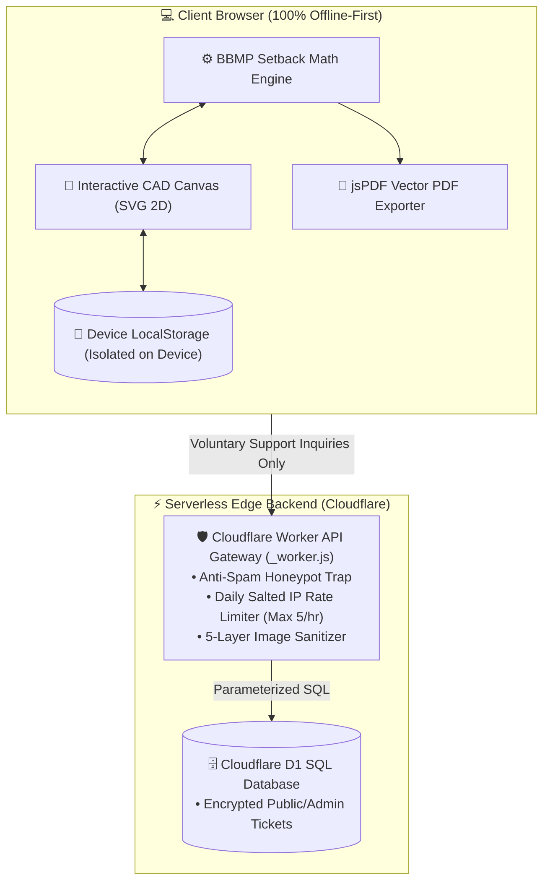

# 🏛️ e-Plan Studio — Automated Single Plot Layout Plan Drafting Engine

[](https://opensource.org/licenses/MIT)
[](#-data-privacy--architectural-integrity)
[](https://single-site-plan.cranbear.workers.dev)
[](#-essential-domain-glossary)

> **Instant, 100% client-side vector CAD site plan generator for single plot layout drawings.**  
> *Designed for B-to-A Khata conversions, Sakala portal submissions, ADLR 11E survey sketches, and municipal layout plan sanctions in Bengaluru, Karnataka.*

🌐 **Live Production Web Application:** [https://single-site-plan.cranbear.workers.dev](https://single-site-plan.cranbear.workers.dev)  
📦 **GitHub Repository:** [https://github.com/manswis/singleSitePlan-web](https://github.com/manswis/singleSitePlan-web)

---

## 📌 Overview

In Bengaluru, Karnataka, property owners converting a **B-Khata property into an A-Khata certificate** (via BBMP Sakala / e-Aasthi portals) are required to submit an official **Single Plot Layout Plan**.

**e-Plan Studio** is an open-source, zero-dependency, Apple HIG-inspired web CAD application that enables property owners, licensed architects, and surveyors to generate, preview, and export 100% legally compliant, publication-ready **2-Page Architectural Drawing Packages** in under 60 seconds.

---

## ✨ Key Features

- ⚡ **Real-Time Live 2D CAD Canvas:** Watch your site plan drawing update on screen as you type, complete with vector dimensions, road overlays, hatch patterns, and compass rose.
- 📐 **Automated BBMP RMP-2015 Setbacks:** Calculates mandatory front, rear, and side open space setbacks automatically based on plot area, building height, and road width regulations.
- 🔷 **Regular & Irregular Plot Geometries:** Supports rectangular, trapezoidal, and complex surveyor polygons with custom diagonal measurements and splay boundaries.
- 🔒 **100% Local Client-Side Privacy:** Zero server uploads for CAD math. All property survey numbers, eKhata IDs (ePID), addresses, and CAD geometry remain exclusively inside local browser memory (`localStorage`).
- 📄 **Official 2-Page Sakala PDF Package:** Exports a consolidated 2-page vector PDF:
  - **Page 1:** 70:30 Split-Frame Architectural Site Plan Drawing + Title Block + ADLR Header + General Notes.
  - **Page 2:** Official Colour & Line Specifications Legend Sheet with licensed architect signature & seal blocks.
- 💬 **Live Support Desk & Timeline Tracker:** Integrated issue resolution and feature request hub with real-time status tracking, Apple-style consent dialog, and verified developer conversation threads.
- 📱 **Responsive Apple HIG Workbench:** Seamlessly adapts across mobile, tablet, and desktop viewports with dark/light mode switching.

---

## 🏛️ System Architecture



---

## 🏗️ Repository Structure

```
singleSitePlan-web/
├── index.html                # Google-style landing page hub & 7-step wizard
├── studio.html               # Live 2D CAD Workbench with interactive controls
├── contact.html              # Support & issue tracker with timeline conversation
├── admin.html                # Secure Apple/Google-grade Admin support desk console
├── pricing.html              # Transparent free tier & pro architectural plans
├── legal.html                # Legally binding Terms of Service & Privacy (DPDP compliant)
├── faq.html                  # Interactive field-by-field guide & Sakala FAQ accordions
├── _worker.js                # Cloudflare Workers serverless API router & D1 bindings
├── build.js                  # Ultra-fast esbuild asset minification & bundling script (<30ms)
├── package.json              # Project scripts (build, dev, deploy) & build dependencies
├── schema.sql                # Standalone D1 database table and index definitions
├── wrangler.toml             # Cloudflare Workers & D1 deployment manifest
├── .assetsignore             # Excludes backend worker files & node_modules from public assets
├── .gitignore                # Standard Git ignore rules for node, wrangler & OS files
├── favicon.svg               # Vector SVG blueprint favicon
├── LICENSE                   # Official MIT Open Source License
├── README.md                 # Project documentation (This file)
├── css/
│   ├── styles.css            # Human-readable master CSS design tokens & print styles
│   └── styles.min.css        # Compressed production stylesheet (83 KB)
└── js/
    ├── admin.js              # Human-readable admin controller & session security
    ├── admin.min.js          # Production minified admin controller
    ├── analytics.js          # Session deduplicated live stats counter
    ├── analytics.min.js      # Production minified analytics counter
    ├── contact.js            # Helpdesk controller, consent modal & timeline renderer
    ├── contact.min.js        # Production minified helpdesk controller
    ├── renderer.js           # SVG 2D CAD vector graphics rendering engine
    ├── renderer.min.js       # Production minified CAD renderer
    ├── studio.bundle.min.js  # Unified single-bundle production CAD engine
    ├── theme.js              # Automatic Dark/Light mode theme manager
    ├── theme.min.js          # Production minified theme manager
    ├── ui.js                 # DOM interaction handlers & PDF export engine (jsPDF)
    ├── ui.min.js             # Production minified UI handlers
    ├── validator.js          # Sakala data validation rules & error focus engine
    ├── validator.min.js      # Production minified validator
    ├── wizard.js             # 7-step guided wizard state manager & draft persistence
    └── wizard.min.js         # Production minified wizard
```

---

## 🛠️ Technology Stack

- **Frontend Core:** Semantic HTML5, Vanilla JavaScript (ES6+), Vanilla CSS3 (Apple Design System).
- **Build Engine:** `esbuild` for ultra-fast, zero-runtime production minification and code compression.
- **Vector CAD Engine:** Scalable Vector Graphics (SVG) with mathematical coordinate transformations.
- **Document Generation:** `jsPDF` + `html2canvas` for client-side vector PDF compilation.
- **Serverless API & Edge Hosting:** Cloudflare Workers with Static Assets.
- **Database:** Cloudflare D1 (Distributed Serverless SQLite).
- **Typography & Icons:** Google Fonts (Outfit, Inter) and Google Material Symbols.

---

## 💻 Local Development Setup

The project provides human-readable source code for development and an automated `esbuild` pipeline for generating compressed, high-performance production assets.

### 1. Clone & Install Dependencies
```bash
git clone https://github.com/manswis/singleSitePlan-web.git
cd singleSitePlan-web
npm install
```

### 2. Build Production Assets (< 30ms)
To minify all JavaScript modules and CSS stylesheets into production `.min` files:
```bash
npm run build
```
*Outputs size savings breakdown and builds `js/*.min.js`, `js/studio.bundle.min.js`, and `css/styles.min.css`.*

---

### Option A: Static Frontend Only (No Backend)

Serve locally via any static web server:
```bash
# Using Python 3
python3 -m http.server 8000

# Or using npx serve
npx serve ./
```
Open `http://localhost:8000` in your web browser.

---

### Option B: Full-Stack with Cloudflare D1 & Worker API

To test the support desk API and database integration locally using Wrangler:

1. **Authenticate with Cloudflare (one-time):**
   ```bash
   npx wrangler login
   ```

2. **Initialize the local D1 SQLite database:**
   ```bash
   npx wrangler d1 execute single_site_plan_support_tickets_db --local --file=schema.sql
   ```

3. **Start the local edge development server:**
   ```bash
   npm run dev
   ```
   Open `http://localhost:8787` in your browser. Both static CAD drafting and `/api/tickets` will run locally with instant hot-reloading.

---

### 🚀 Production Deployment
To build minified assets and deploy directly to Cloudflare Workers:
```bash
npm run deploy
```

---

## 🗄️ Cloudflare D1 Database Integration & Deployment Guide

If you fork this repository to deploy your own instance, follow these steps to connect your Cloudflare D1 database:

### 1. Create a D1 Database
Run the following command to create a serverless D1 instance in your Cloudflare account:
```bash
npx wrangler d1 create single_site_plan_support_tickets_db
```

Wrangler will output your unique `database_id`, for example:
```toml
[[d1_databases]]
binding = "DB"
database_name = "single_site_plan_support_tickets_db"
database_id = "your-database-uuid-here"
```

### 2. Update `wrangler.toml`
Paste your database details into `wrangler.toml`:
```toml
name = "single-site-plan"
main = "_worker.js"
compatibility_date = "2024-09-23"

[assets]
directory = "."
binding = "ASSETS"

[[d1_databases]]
binding = "DB"
database_name = "single_site_plan_support_tickets_db"
database_id = "your-database-uuid-here"
```

### 3. Run Remote Database Migrations
Execute `schema.sql` against your remote Cloudflare database:
```bash
npx wrangler d1 execute single_site_plan_support_tickets_db --remote --file=schema.sql
```

### 4. Configure Your Admin Passkey (`ADMIN_SECRET`)
To lock your `/admin.html` dashboard behind a secure cryptographic passkey:

#### Option A: Via Wrangler CLI (Recommended)
```bash
npx wrangler secret put ADMIN_SECRET
# Enter your secret passkey when prompted (e.g. MySecretPasskey2026!)
```

#### Option B: Via Cloudflare Dashboard
1. Go to **Cloudflare Dashboard** → **Workers & Pages** → select your worker (`single-site-plan`).
2. Navigate to **Settings** → **Variables and Secrets**.
3. Under **Environment Variables**, click **Add variable**.
4. Set **Variable name** to `ADMIN_SECRET`, type your secret passkey, check **Encrypt**, and click **Save and Deploy**.

### 5. Deploy to Production
```bash
npx wrangler deploy
```

---

## 🛡️ Admin Ticket Triage & Response Workflow

Once deployed, you have two ways to manage tickets:

### Method 1: Using the Web-Based Admin Console (Recommended)
1. Navigate to `https://your-domain.workers.dev/admin.html` in your browser.
2. Enter the `ADMIN_SECRET` passkey you configured above.
3. Review ticket details, view client diagnostics, click **1-click canned response chips**, change ticket status, and post verified timeline replies without writing any SQL!

---

### Method 2: Direct SQL Queries (via Cloudflare Console / CLI)

Admins can also triage and reply directly from the Cloudflare Dashboard D1 Console or via Wrangler CLI:

#### 1. View Recent Inquiries:
```sql
SELECT id, type, priority, status, name, email, subject, message, created_at 
FROM tickets 
ORDER BY created_at DESC 
LIMIT 20;
```

#### 2. Post a Verified Response to the User's Timeline:

##### Option A: Post a Structured JSON Multi-Message Thread:
```sql
UPDATE tickets 
SET status = 'in_progress',
    public_response = '[
      {
        "text": "Hi! We investigated your setback report and identified the corner splay formula bug.", 
        "time": "2026-08-15 17:35:00", 
        "author": "e-Plan Studio Engineering Team"
      },
      {
        "text": "Fix deployed in v1.2. Please re-generate your PDF and let us know if it matches your survey sketch.", 
        "time": "2026-08-15 17:50:00", 
        "author": "Lead Developer"
      }
    ]',
    updated_at = CURRENT_TIMESTAMP
WHERE id = 'REQ-BCE5-T923';
```

#### Option B: Quick Multi-Line Reply (using `---` separator):
```sql
UPDATE tickets 
SET status = 'resolved',
    public_response = 'We updated the setback schedule for your ward.
---
Patch deployed and verified on production.',
    updated_at = CURRENT_TIMESTAMP
WHERE id = 'REQ-BCE5-T923';
```

When the user visits `contact.html?track=REQ-BCE5-T923`, the timeline conversation thread will automatically render your verified replies with timestamps!

---

## 🤝 How to Contribute

Contributions from software engineers, civil engineers, architects, and legal experts are warmly welcome!

### Contribution Workflow:
1. **Fork** the repository on GitHub.
2. **Create a Feature Branch:**
   ```bash
   git checkout -b feature/amazing-feature
   ```
3. **Commit Your Changes:**
   ```bash
   git commit -m "Add amazing new feature"
   ```
4. **Push to the Branch:**
   ```bash
   git push origin feature/amazing-feature
   ```
5. **Open a Pull Request:** Navigate to the repository on GitHub and click **New Pull Request**.

### Areas Where You Can Help:
- 📐 **Municipal Regulatory Formats:** Preset rules for BDA, BMRDA, DTCP, or other municipal corporations in India.
- 🎨 **CAD Drawing Algorithms:** Splayed road junctions, arc curves, irregular polygon triangulation.
- 🌐 **Localization:** Adding Kannada (ಕನ್ನಡ) language translations for field labels and guide tooltips.
- 🧪 **Automated Testing:** Unit test suites for setback mathematical formulas and SVG coordinate generators.

---

## 📚 Essential Domain Glossary

| Term | Description |
| :--- | :--- |
| **A-Khata** | The official, fully legal property tax register certificate issued by BBMP. Enables bank home loans, building plan sanctions, and trade licenses. |
| **B-Khata** | A temporary register entry maintained by BBMP to collect property tax from properties with minor planning violations, unapproved layouts, or missing DC conversions. |
| **ePID (Electronic Property ID)** | A mandatory 10–15 digit unique electronic identifier assigned to every e-Khata property (e.g. `150200101402200142`). Used as the primary lookup key on Karnataka revenue portals. |
| **ADLR 11E Survey Sketch** | An official survey sketch issued by the Assistant Director of Land Records (ADLR) through the Karnataka *Bhoomi Mojini* portal confirming physical plot geometry. |
| **DC Conversion Order** | Official permission issued by the Deputy Commissioner allowing agricultural land to be converted for residential non-agricultural use under Section 95 of the KLR Act 1964. |
| **Schedule of Property (Deed DNA)** | The legal description in a Karnataka Sale Deed specifying what borders the site on 4 cardinal sides (*North by*, *South by*, *East by*, *West by*). Under Karnataka law, **boundary descriptions prevail over area measurements in court disputes**. |

---

## ⚖️ Legal Terms & Disclaimer

- **MIT License:** Distributed under the permissive [MIT License](LICENSE).
- **Independent Open-Source Tool:** **e-Plan Studio** is an independent open-source software utility and is NOT affiliated with, authorized by, endorsed by, or connected to Bruhat Bengaluru Mahanagara Palike (BBMP), Bangalore Development Authority (BDA), Sakala Services, Karnataka Revenue Department, ADLR, or the Government of Karnataka.
- **Mandatory Professional Audit:** Layout plans generated by this software serve strictly as preliminary mathematical reference drafts. All final submission packages submitted to municipal authorities must be independently verified, signed, and stamped by a Council of Architecture (COA) registered architect or licensed supervisor.
- **Trademark Acknowledgment:** *"BBMP", "Bruhat Bengaluru Mahanagara Palike", "e-Khata", "ePID", "Sakala", "ADLR", "11E Sketch", "BDA", and "Bhoomi Mojini"* are trademarks or official service acronyms belonging to the Government of Karnataka. Reference to these marks is made strictly for descriptive compatibility purposes (nominative fair use).

---

<p align="center">
Made with ❤️ for property owners, architects, and open-source developers in Bengaluru.
</p>